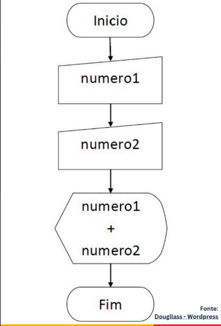
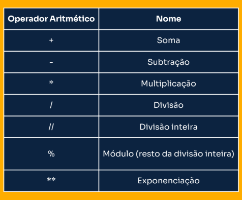
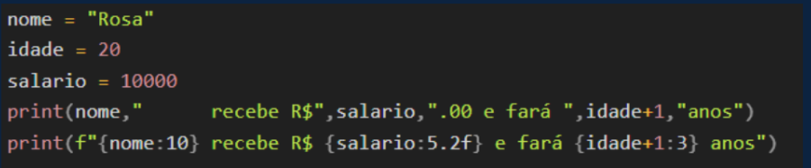

### aula 1 - 17/04/2025

### conceitos básicos

**Algoritmo**

Um algoritmo é uma descrição lógica, precisa e executável de uma sequencia finita de ações para realizar uma tarefa. Por exemplo, uma receita culinária ou um manual de instruções

**Linguagem de programação**

Uma linguaguem de programação é o meio usado para escrever os algortimos que especificam o que os computadores devem fazer  

As palavras de uma linguagem de programação são as instruções usadas para escrever a lógica de um algortimo para um computador

Python é uma linguagem de programação fácil de aprender, amplamente difundida e muito versatil

### Estrutura básica de um algoritmo

1. entrada: quais dados sao necessarios?  
2. processamento: como manipular esses dados?  
3. saida: quais dados devem ser retornados?

### Variaveis

- As variaveis sao usadas para armazenar dados em um algoritmo

Em python uma variavel é criada com o operador =

exemplos:

- n1 = 20  
- n2 = 10  
adicao = n1 + n2  
subtracao = n1 - n2  
multiplicacao = n1 * n2  
divisao = n1/n2  

### tipos de variavies 

- As variaveis manipulam informações de acordo com seu tipo de dado. 

- Os tipos de dados primitivos em python incluem:
    - inteiro(int): numeros sem casas decimais
    - float(float): numeros com casas decimais
    - string(str): sequencias de caracteres 
    - booleano(bool): Verdadeiro(true) ou falso(false)

- Python distingue variaveis por causa e tipo dinamico, significando que o tipo da variavel pode mudar conforme o valor armazenado.

### Operadores aritmeticos basicos

- Python utiliza operadores aritmeticos como +,-,*,/,//,% e ** para calculos matematicos.

- A ordem das operaçoes segue PEMDAS(Parenteses,Exponenciação, Multiplicação/divisao, Adiçao/subtração)

### entrada e saída 

Os comandos de entrada e saída permitem, respectivamente, obter e exibir informações

Em python **input** é o comando de entrada padrao e **print** é o comando padrao para exibir mensagens, expressoes e/ou valores de variaveis na tela do usuario

### formatando a saída de dados

- A formatação dos dados é essencial para apresentar informaçoes de forma clara e adaptada às necessidades do usuario, em python, existem varias maneiras de formatar a saida de dados:

-**(f"")**: Uma forma mais moderna e intutitiva de formatar strings.
- Com **f"()"**, voce pode embutir expressoes diretamente na string.  
Exemplo: f"(variavel:5.2f)" para definir o numero de casas decimais 

- Essas tecnicas ajudam a ajustar a apresentaçao dos dados, como alinhar texto, definir casas decimais em valores numericos e ate combinar strings de fomra flexivel

### Primeiros passos em python

### google colab

é um ambiente de programação online que permite escrever e executar codigo python diretamente no navegador, sem a necessidade de instalaçao de um programa

### vscode

é uma ferramenta bastante poderosa para desenvolvimento e pode ser instalada gratuitamente 

video ensinando a instalar o vs code e configurar o python dentro dele: https://www.youtube.com/watch?v=Zy3iaMZbPO8

### dicas

- comentarios ajudam voce e outros a entenderem o que cada parte do codigo faz. Explicar a logica por tras de trechos complexos facilita revisões e manutenções

- use nomes de variaveis e funçoes que sejam descritivos, para que o codigo seja facil de entender

- programaçao é uma habilidade pratica. Dedique tempo para escrever e revisar codigos todos os dias, mesmo que sejam exercicios pequenos

- em vez de tentar resolver um problema grande de uma vez, divida - o em partes menores e resolva cada uma separadamente

- ler e entender mensagens de erro é uma habilidade essencial. Erros sao parte do aprendizado. Use print() ou o depurador para acompanhar o que está acontecendo em cada etapa do código

- A documentação oficial do python e recursos como stack overflow podem ajudar a resolver duvidas e aprender melhores praticas. **A documentaçao é uma aliada valiosa!**

- o erro faz parte do processo de aprendizado. Cada erro é uma oportunidade de entender o que deu errado e de aprender uma solução nova. **Persistencia é a chave**

